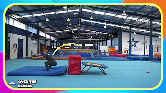
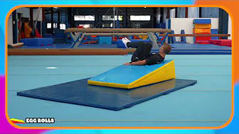
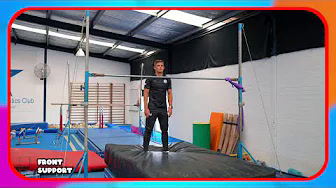
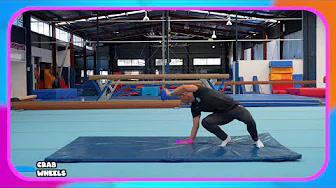
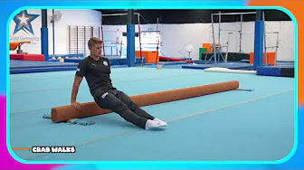
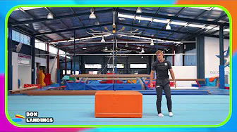

# Provutkast: Fun gymnastics stations

**Källa:** [Fun gymnastics stations](https://youtu.be/2DJ_oMM81mI) · Prime Coaching Sport · 4:29 · publicerad 6 aug 2023

> ⚠️ **Videon visar inte en framåtvolt-progression.** Det är 12 grundstationer för nybörjare (trampett, kil, räcke, golvmatta, bom, rockringar, låda). Ingen station innehåller volt eller salto. Utkasten nedan beskriver det som faktiskt visas. Kolla om det är rätt länk.

Så togs innehållet fram: YouTube krävde inloggning (botkontroll), så videon kunde inte laddas ner. Underlaget är ljudspåret (via webbsidan), beskrivningen, kapitlen och 6 kapitelbilder från YouTube. Alla texter är skrivna med egna ord. Alla utkast är `needsCoachReview`.

**Nivå (alla):** Nybörjare, ca 5–9 år (videon riktar sig till skolidrott F–3, 'elementary PE')

---

## 1. Grenhopp från trampett

⏱ 6 min · Teknik · lätt · tillförlitlighet: **medel**

**Varför:** Grenform i luften och en stabil landning. Första steget mot att hoppa former från trampett med kontroll, inte höjd.

**Så gör du:**

1. Kort ansats, studs mitt i trampetten.
2. Benen ut åt sidorna och fram, armarna sträcks mot tårna.
3. Samla benen före landning och landa på två fötter på mattan: böjda knän, armarna fram.
4. En i taget, nästa går när mattan är fri.

**Se upp för:** Lång eller snabb ansats, studs nära kanten, benen kvar isär i landningen.

**Säkerhet:** Landningsmatta direkt efter trampetten. En i taget. Ingen springer in förrän landningen är klar.

**Redskap:** Trampett ×1, Landningsmatta ×1
- ⚠️ Videon visar en liten studsmatta (minitramp); vi mappar den till trampett.

**Taggar:** teknik, trampett, hopp, landning, grenhopp

**Bygger vidare på:** Landningar upp på och ner från plint

**Lättare variant av:** Formhopp över block från trampett

**Källa:** [0:16](https://youtu.be/2DJ_oMM81mI?t=16) (kapitelstart, kapitel ”Mini tramp”)

**Osäkert:** Ingen bild från just den här stationen; uppställningen antas vara samma som i nästa station (trampett + matta). Rörelsen bygger på ljudspåret.

---

## 2. Formhopp över block från trampett

⏱ 6 min · Teknik · lätt · tillförlitlighet: **hög**

**Varför:** Ett lågt block mellan trampett och matta ger gymnasten ett mål att hoppa över. Tränar höjd, form i luften och landning.

**Så gör du:**

1. Ställ ett lågt mjukt block mellan trampetten och landningsmattan.
2. Studsa och hoppa över blocket med en form: ljushopp, krupen eller gren.
3. Landa på två fötter på mattan med böjda knän.
4. Bygg på med fler block när landningarna sitter.

**Se upp för:** Fötter som tar i blocket, gymnaster som tittar ner, att svårigheten höjs innan landningen är stabil.

**Säkerhet:** Bara mjuka block, aldrig hårda kanter. Landningsmattan ska räcka långt bakom blocket. En i taget.

**Redskap:** Trampett ×1, Landningsmatta ×1
- ⚠️ Mjukt block (röd skumkloss) mellan trampett och matta – finns inte i redskapslistan. Ersätt t.ex. med en plintdel i skum.
- ⚠️ Studsmattan i videon är en liten minitramp, inte en klassisk trampett.

**Taggar:** teknik, trampett, hopp, former, landning

**Bygger vidare på:** Grenhopp från trampett

**Källa:** [ca 0:30](https://youtu.be/2DJ_oMM81mI?t=30) (uppskattad, kapitel ”Mini tramp”, syns i bild vid 0:41)

**Osäkert:** Uppställningen syns på bild (trampett, rött block, blå matta). Exakt starttid för stationen är uppskattad; blockhöjden är okänd.

---

## 3. Äggrullning nerför kil

⏱ 6 min · Teknik · intro · tillförlitlighet: **medel**

**Varför:** Gymnasten håller en hopkrupen form medan kroppen rullar nerför kilen. Bygger spänning, rund form och trygghet i att rotera.

**Så gör du:**

1. Lägg kilen på en matta. Gymnasten ligger på rygg högst upp.
2. Dra upp knäna, håll om dem och för hakan mot bröstet.
3. Rulla nerför kilen och håll formen hela vägen ner.
4. Nästa startar när ytan nedanför är fri.

**Se upp för:** Formen som släpper (ben eller armar åker ut), hakan som åker upp.

**Säkerhet:** Kilen ligger stadigt på en matta. Bara en i taget i backen.

**Redskap:** Madrass ×1
- ⚠️ Kilmatta (gul/blå kil) – finns inte i redskapslistan.
- ⚠️ Underlaget i videon är en tunnare blå matta; vi mappar den till madrass.

**Taggar:** teknik, rullning, kil, form, nybörjare

**Källa:** [0:50](https://youtu.be/2DJ_oMM81mI?t=50) (kapitelstart, kapitel ”Wedge”, syns i bild vid 0:54)

**Osäkert:** Kil + matta syns på bild. Rullriktningen är osäker: bilden ser ut som att gymnasten ligger tvärs över kilen (rullar åt sidan), men det syns inte säkert.

---

## 4. Spindelmannen uppför kil

⏱ 6 min · Teknik · lätt · tillförlitlighet: **låg**

**Varför:** Gymnasten går upp med fötterna på kilen och hamnar i ett lutande stöd. Bygger raka, starka armar och vana att bära kroppen på händerna.

**Så gör du:**

1. Ställ kilen stadigt mot en vägg. Gymnasten står med ryggen mot kilen och sätter händerna i golvet.
2. Gå upp med fötterna mot kilens topp.
3. Gå närmare med händerna tills kroppen ligger rak mot kilen, armarna raka.
4. Gå långsamt ner med fötterna igen.

**Se upp för:** Armar som viker sig, svank, att någon går högre än de orkar ta sig ner från.

**Säkerhet:** Kilen ska stå stadigt mot väggen. Matta under händerna. Gå ner lugnt, aldrig hoppa ner.

**Redskap:** Madrass ×1
- ⚠️ Kilmatta lutad mot vägg – finns inte i redskapslistan. Madrassen är vårt förslag som underlag; den syns inte i videon.

**Taggar:** teknik, styrka, handstående, kil, armstöd

**Källa:** [ca 1:15](https://youtu.be/2DJ_oMM81mI?t=75) (uppskattad, kapitel ”Wedge”)

**Osäkert:** Ingen bild från stationen. Bygger bara på ljudspåret. Starttid är en gissning mellan 0:54 och 1:39.

---

## 5. L-häng i räcke

⏱ 6 min · Teknik · lätt · tillförlitlighet: **medel**

**Varför:** Gymnasten hänger med raka armar och lyfter benen framåt. Tränar bål och grepp som behövs i räckesövningar.

**Så gör du:**

1. Gymnasten hänger i räcket med raka armar.
2. Lyft benen fram så raka som möjligt, tårna pekar framåt.
3. Håll några sekunder och sänk benen lugnt.
4. Böj knäna om raka ben inte går än.

**Se upp för:** Gungande kropp, böjda armar, ben som faller ner okontrollerat.

**Säkerhet:** Matta under räcket. Räcket så lågt att gymnasten når själv. Ledare nära vid första försöken.

**Redskap:** Landningsmatta ×1
- ⚠️ Räcke (lågt räcke/stång) – finns inte i redskapslistan.

**Taggar:** teknik, räcke, bål, grepp, styrka

**Källa:** [1:39](https://youtu.be/2DJ_oMM81mI?t=99) (kapitelstart, kapitel ”Bars”)

**Osäkert:** Ingen bild från just L-hänget; räcke och matta syns i nästa station. Kan passa lika bra under Styrka.

---

## 6. Stöd på räcke med pendel

⏱ 6 min · Teknik · lätt · tillförlitlighet: **hög**

**Varför:** Upp i stöd på räcket med raka armar och spänd kropp. Grunden för alla räckesövningar och en trygg nedgång.

**Så gör du:**

1. Gymnasten trycker sig upp i stöd, raka armar, händerna ovanpå stången.
2. Håll kroppen rak och spänd. Pendla benen fram och bak tre gånger.
3. Tryck ifrån bakåt och landa på mattan: böjda knän, armarna fram.

**Se upp för:** Böjda armar, axlar som sjunker, höfter som viker sig vid stången, landning för nära räcket.

**Säkerhet:** Matta under och bakom räcket. Räcket i lagom höjd för gruppen. Ledare står nära vid nedgången.

**Redskap:** Landningsmatta ×1
- ⚠️ Räcke (enkel stång på ställning) – finns inte i redskapslistan.

**Taggar:** teknik, räcke, stöd, landning

**Källa:** [ca 1:55](https://youtu.be/2DJ_oMM81mI?t=115) (uppskattad, kapitel ”Bars”, syns i bild vid 2:07)

**Osäkert:** Räcke och tjock matta under syns på bild. Greppet beskrivs otydligt i ljudet ('tummarna ovanpå'); vi skriver bara 'händerna ovanpå stången'.

---

## 7. Åsnesparkar

⏱ 6 min · Teknik · lätt · tillförlitlighet: **medel**

**Varför:** Ett litet hopp upp på händerna med benen sparkade bakåt. Tidigt steg mot att våga lägga vikten på händerna inför handstående.

**Så gör du:**

1. Armarna raka och upp framför kroppen, ett ben böjt fram och ett rakt bak.
2. Sätt händerna i mattan, skjut ifrån med det främre benet och sparka upp bakåt.
3. Landa mjukt på fötterna. Byt ben varannan gång.

**Se upp för:** Armar som viker sig, huvudet långt fram mellan armarna, bara ett ben.

**Säkerhet:** Matta under. Avstånd mellan gymnasterna så ingen får en spark. Ingen tävling om höjd.

**Redskap:** Tumblingmatta ×1
- ⚠️ Videon visar hopvikbara golvmattor (panelmattor); vi mappar till tumblingmatta.

**Taggar:** teknik, handstående, golv, armstöd

**Källa:** [2:26](https://youtu.be/2DJ_oMM81mI?t=146) (kapitelstart, kapitel ”Floor mats”)

**Osäkert:** Ingen bild från stationen. Rörelsen bygger på ljudspåret; om händerna sätts i mattan sägs inte uttryckligen.

---

## 8. Minihjul (krabbhjul)

⏱ 6 min · Teknik · intro · tillförlitlighet: **hög**

**Varför:** Ett litet hjul nära golvet: hand, hand, fot, fot. Lär rytmen och handisättningen i hjulet utan höjd.

**Så gör du:**

1. Börja på huk vid ena sidan av mattan, armbågarna nära kroppen.
2. Sätt ner händerna en i taget och hoppa över fötterna till andra sidan: hand, hand, fot, fot.
3. Gör åt båda håll.
4. Höj höfterna lite mer när rytmen sitter.

**Se upp för:** Fel ordning på händer och fötter, händer som hamnar för långt bort, bara ett håll.

**Säkerhet:** Fri bana. En i taget på mattan. Ingen står där fötterna landar.

**Redskap:** Tumblingmatta ×1
- ⚠️ Videon visar en hopvikbar golvmatta (panelmatta); vi mappar till tumblingmatta.

**Taggar:** teknik, hjul, golv, nybörjare

**Lättare variant av:** Hjul (befintlig övning)

**Källa:** [ca 2:45](https://youtu.be/2DJ_oMM81mI?t=165) (uppskattad, kapitel ”Floor mats”, syns i bild vid 2:54)

**Osäkert:** Matta och rörelse syns på bild. Exakt starttid uppskattad.

---

## 9. Soldatsparkar på bom

⏱ 6 min · Teknik · lätt · tillförlitlighet: **medel**

**Varför:** Gå längs bommen och sparka fram med raka ben. Tränar balans, raka ben och spänd kropp på smal yta.

**Så gör du:**

1. Armarna ut åt sidan för balansen.
2. Ta ett steg och sparka det andra benet rakt fram, tårna pekar.
3. Byt ben varje steg hela vägen till slutet.
4. Hoppa ner i slutet och landa på två fötter med böjda knän.

**Se upp för:** Böjda ben, blicken ner i bommen, för snabbt tempo.

**Säkerhet:** Låg bom med matta bredvid och vid nedhoppet. En i taget på bommen.

**Redskap:** Landningsmatta ×1
- ⚠️ Bom (låg bom) – finns inte i redskapslistan. Landningsmattan vid nedhoppet är vårt förslag; den syns inte i videon.

**Taggar:** teknik, bom, balans, raka ben

**Bygger vidare på:** Balansgång (befintlig övning)

**Källa:** [3:04](https://youtu.be/2DJ_oMM81mI?t=184) (kapitelstart, kapitel ”Beam”)

**Osäkert:** Ingen bild från stationen; bomhöjden okänd (i nästa station ligger bommen lågt nära golvet).

---

## 10. Krabbgång längs bom

⏱ 6 min · Teknik · lätt · tillförlitlighet: **hög**

**Varför:** Bakåtstöd med händerna på bommen och förflyttning i sidled. Bygger stark axelposition och raka armar.

**Så gör du:**

1. Sitt bredvid bommen och sätt händerna på den bakom dig.
2. Lyft till bakåtstöd med raka armar och så raka ben som möjligt.
3. Flytta händer och fötter i sidled längs hela bommen.

**Se upp för:** Böjda armar, höfter som sjunker mot golvet, axlar som åker upp mot öronen.

**Säkerhet:** Bom som står stadigt på golvet. Avbryt om handlederna eller axlarna gör ont.

**Redskap:** –
- ⚠️ Bom (låg bom direkt på golvet) – finns inte i redskapslistan.

**Taggar:** teknik, bom, stöd, axlar, styrka

**Källa:** [ca 3:25](https://youtu.be/2DJ_oMM81mI?t=205) (uppskattad, kapitel ”Beam”, syns i bild vid 3:34)

**Osäkert:** Låg bom och bakåtstöd syns på bild. Benen ser lätt böjda ut på bilden; vi skriver 'så raka som möjligt'.

---

## 11. Ljushopp i rockringar

⏱ 6 min · Teknik · intro · tillförlitlighet: **medel**

**Varför:** Raka ljushopp från ring till ring i sicksack. Tränar spänd kropp, samlade ben och rytm i hoppen.

**Så gör du:**

1. Lägg ut rockringar i en sicksack.
2. Hoppa jämfota från ring till ring.
3. I varje hopp: armarna raka över huvudet, benen ihop, kroppen rak.
4. Landa mjukt med böjda knän.

**Se upp för:** Armar som åker ner, ben isär, hårda landningar.

**Säkerhet:** Ringarna ligger platt på golvet. Avstånd mellan gymnasterna i banan.

**Redskap:** –
- ⚠️ Rockringar – finns inte i redskapslistan (koner kan markera banan om ringar saknas).

**Taggar:** teknik, hopp, ljushopp, golv, nybörjare

**Källa:** [3:47](https://youtu.be/2DJ_oMM81mI?t=227) (kapitelstart, kapitel ”Misc”)

**Osäkert:** Ingen bild från stationen. Antal ringar och avstånd okänt.

---

## 12. Landningar upp på och ner från plint

⏱ 6 min · Teknik · intro · tillförlitlighet: **hög**

**Varför:** Hopp upp på en låg plint, stabil landning, sedan hopp ner med en form. Grunden för alla trygga landningar.

**Så gör du:**

1. Hoppa jämfota upp på plinten och landa stilla: böjda knän, armarna fram.
2. Hoppa ner med en form, t.ex. ljushopp eller krupen.
3. Landa stilla på golvet i samma landning och håll två sekunder.

**Se upp för:** Raka ben i landningen, knän som faller inåt, att gymnasten tar steg efter landningen.

**Säkerhet:** Låg och stadig plint. Mjukt underlag vid nedhoppet. En i taget.

**Redskap:** Plint ×1
- ⚠️ Lådan i videon ser ut som ett orange mjukt skumblock; vi mappar till plint.

**Taggar:** teknik, landning, hopp, plint, nybörjare

**Lättare variant av:** Grenhopp från trampett

**Källa:** [ca 4:05](https://youtu.be/2DJ_oMM81mI?t=245) (uppskattad, kapitel ”Misc”, syns i bild vid 4:13)

**Osäkert:** Låda och golv syns på bild. Lådans höjd och material uppskattade. Länken till grenhopp är vår egen bedömning.
